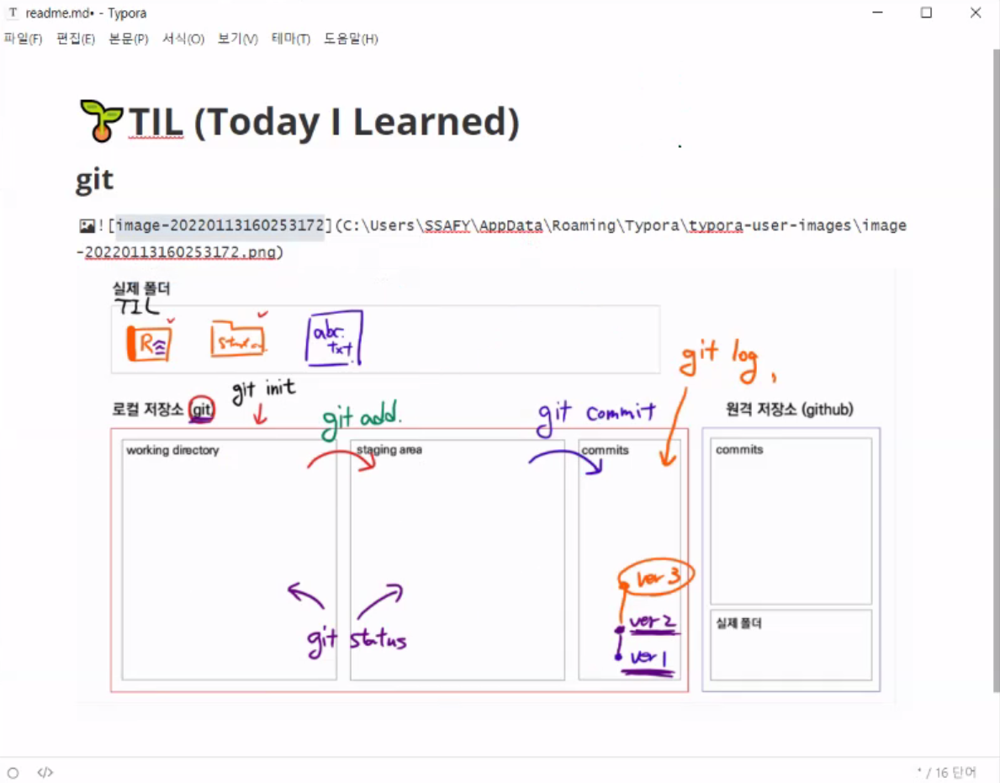

## Git & Github

---

#### 1. Git 정의

* 버전 관리 프로그램

  * 중앙 집중식 버전 관리

  * **분산 버전 관리**

#### 2. Github 정의

* Git 으로 관리하는 버전을 Github 라는 네트워크 서버에 업로드하는 것
* Gitlab, Bitbucket 등 다른 서비스도 존재

#### 3. Git 의 기본적인 구조

